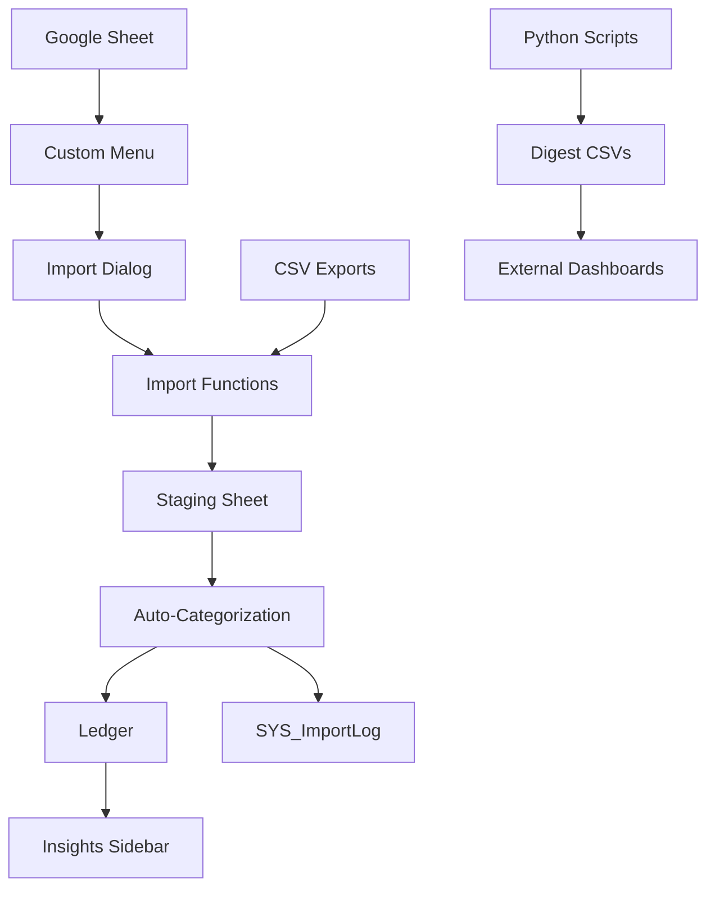

# Architecture & Design

> Deep dive into the Apps Script design, data flow, Python pipeline, and performance characteristics.

## Table of Contents
- [High-Level Overview](#high-level-overview)
- [Apps Script Structure](#apps-script-structure)
- [Data Flow](#data-flow)
- [Rule Engine](#rule-engine)
- [UI Components](#ui-components)
- [Python Analytics Pipeline](#python-analytics-pipeline)
- [Caching & Performance](#caching--performance)
- [Error Handling](#error-handling)
- [Security Model](#security-model)

## High-Level Overview

The solution centers around a Google Sheet enhanced by Apps Script. CSV imports land in a staging sheet, rules categorize transactions, and digest scripts extend insights beyond the spreadsheet.

## Apps Script Structure
- **Entry Points**: `onOpen` registers menu items and ensures supporting sheets exist.
- **Import Layer**: `importCsvFiles` dispatches files to bank-specific parsers. Each parser enforces consistent schema and logs statistics.
- **Processing Layer**: `runAutoCategorization` applies rules, caching compiled regex patterns for performance.
- **Transfer Layer**: `importToTransactions` migrates reviewed rows to the ledger, preserving auditability.

## Data Flow
1. User uploads CSV via modal dialog.
2. Script detects bank format, parses rows, and appends them to `STG_Transactions`.
3. `SYS_ImportLog` captures row counts and timestamps.
4. Auto-categorization annotates rows with categories, rule IDs, and confidence.
5. User initiates staging → ledger import, optionally bounded by date.
6. Ledger feeds dashboards and Python digests.

## Rule Engine
- Rules loaded from `SYS_CatRules` are compiled into regex objects with numeric bounds.
- Matching returns the first rule meeting regex and amount criteria; priority ensures deterministic order.
- Confidence scoring factors in match specificity (regex + amount = high).
- Rules cache stored in document properties reduces spreadsheet reads on subsequent runs.

## UI Components
- Dialogs built with HTML/CSS provide a modern UX inside Sheets.
- JS attaches event handlers for drag/drop, file selection, and status updates.
- `google.script.run` bridges dialog interactions with server-side Apps Script, enabling asynchronous execution with success/failure callbacks.
- Future enhancements include review sidebars for manual categorization and rule authoring.

## Python Analytics Pipeline
- `process_net_worth.py` reshapes asset snapshots into monthly trends with drawdown and milestone analysis.
- `process_ibkr_digests.py` dissects IBKR exports, calculates risk metrics using `scipy.stats`, and outputs CSV digests for dashboards.
- Scripts rely on pandas DataFrames, widely used in finance analytics workflows.
- Integrate with BI tools (Looker Studio, Tableau) by uploading digests to Google Drive or a database.

## Caching & Performance
- `loadCategoryRules` caches compiled rules for one hour to avoid repeated regex compilation.
- Auto-categorization processes rows in batches of 100 to stay within Apps Script execution limits.
- Benchmark utilities confirm target throughput of 2,000 transactions within 2 seconds.
- Python scripts vectorize operations with pandas, enabling processing of multi-year exports within seconds.

## Error Handling
- `try/catch` blocks surround import functions; toasts alert users when parsing fails.
- Failed rows skip gracefully without halting the entire file import.
- Python scripts print exceptions and exit with non-zero status for integration with schedulers.

## Security Model
- Sensitive system sheets (`SYS_*`) are hidden by default to prevent tampering.
- Apps Script executes with the spreadsheet owner’s permissions; share the sheet carefully.
- Data never leaves Google’s environment unless Python scripts export digests—store those outputs securely.
- For future API integrations, rely on OAuth2 flows and secret storage rather than embedding credentials.
